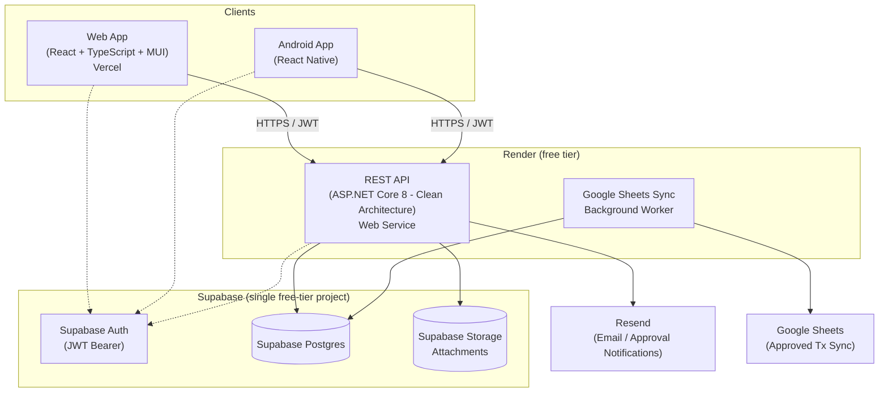

# Finance Ledger Pro

A **Financial Ledger Management System** for small and medium businesses, run as a
zero-cost personal deployment on Render + Supabase + Vercel free tiers. Teams record
income and expense transactions, track cash flow, produce financial summaries, export
reports (Excel / PDF / CSV), and collaborate across multiple branches with an approval
workflow and full audit trail.

---

## Solution Architecture



See [docs/architecture.md](docs/architecture.md) for the full architecture, Postgres
schema design, sequence diagrams, RBAC matrix, and security model, and
[docs/free-tier-deployment.md](docs/free-tier-deployment.md) for the step-by-step
deployment runbook.

---

## Technology Stack

| Layer          | Technology |
|----------------|------------|
| Frontend       | React, TypeScript, Material UI, React Router, TanStack React Query, Axios, Recharts |
| Mobile         | React Native (Android), offline cache + background sync |
| Backend        | ASP.NET Core 8 Web API, EF Core (Npgsql), Clean Architecture, Repository Pattern |
| Database       | Supabase Postgres |
| Auth           | Supabase Auth, JWT Bearer + refresh tokens |
| Storage        | Supabase Storage |
| Hosting        | Render (API Web Service + Worker Background Worker), Vercel (frontend) |
| CI/CD          | Render/Vercel git-integration auto-deploy; GitHub Actions for CI (CodeQL, mobile build) |
| Reporting      | Excel (ClosedXML), PDF (QuestPDF), CSV |
| Notifications  | Resend (Email) |
| Integration    | Google Sheets sync (worker service) |
| Schema         | Supabase SQL migrations (`supabase/migrations`) |
| Observability  | `/health` + `/health/ready` endpoints; Sentry free tier optional |

---

## Repository Structure

```
FinanceLedgerPro/
├── src/
│   ├── FinanceLedger.Domain/          # Entities & enums (no dependencies)
│   ├── FinanceLedger.Application/     # DTOs, interfaces, services, validators
│   ├── FinanceLedger.Infrastructure/  # EF Core Npgsql repos, Supabase Storage/Auth, Resend, exporters
│   ├── FinanceLedger.API/             # Controllers, middleware, Program.cs, OpenAPI, Dockerfile
│   ├── FinanceLedger.Worker/          # Google Sheets background sync, Dockerfile
│   ├── FinanceLedger.Web/             # React + TypeScript web frontend
│   └── FinanceLedger.Mobile/          # React Native Android app
│
├── supabase/
│   └── migrations/                    # Postgres schema (Supabase CLI convention)
│
├── infra/
│   ├── bicep/                         # Legacy Azure Bicep templates — superseded, kept for reference
│   └── github-actions/                # Legacy Azure deploy workflow references — superseded, kept for reference
│
├── .github/workflows/                 # Live GitHub Actions pipelines (CodeQL, mobile build)
│
├── docs/
│   ├── architecture.md
│   ├── deployment-guide.md
│   ├── free-tier-deployment.md        # Step-by-step Supabase/Render/Vercel runbook
│   └── api-reference.md
│
├── render.yaml                        # Render Blueprint (API Web Service + Worker)
├── .env.example                       # All env vars needed across Render + Vercel
└── README.md
```

---

## User Roles

| Capability                          | Manager | User |
|-------------------------------------|:-------:|:----:|
| View dashboard & reports            |   ✅    |  ✅  |
| Create income / expense             |   ✅    |  ✅  |
| View all transactions               |   ✅    | Own / assigned branches |
| Edit transactions                   |   ✅    | Non-approved only |
| Delete transactions                 |   ✅    |  ❌  |
| Approve / reject transactions       |   ✅    |  ❌  |
| Export Excel / PDF / CSV            |   ✅    | View-based |
| Manage users                        |   ✅    |  ❌  |
| Manage branches                     |   ✅    |  ❌  |
| View audit logs                     |   ✅    |  ❌  |

---

## Getting Started (Local)

### Prerequisites
- [.NET 8 SDK](https://dotnet.microsoft.com/download)
- [Node.js 18+](https://nodejs.org) (for web & mobile)
- A [Supabase](https://supabase.com) project (free tier) — Postgres, Auth, and Storage.
  The [Supabase CLI](https://supabase.com/docs/guides/cli) can also run all three locally
  (`supabase start`) if you'd rather not point local dev at the hosted project.

### Backend API
```bash
cd src/FinanceLedger.API
dotnet restore
dotnet run
# Swagger UI: https://localhost:5001/swagger
```

### Web Frontend
```bash
cd src/FinanceLedger.Web
npm install
cp .env.example .env   # set VITE_API_BASE_URL
npm run dev
```

### Mobile App
```bash
cd src/FinanceLedger.Mobile
npm install
cp .env.example .env   # set API_BASE_URL
npm run android
```

### Google Sheets Sync Worker
```bash
cd src/FinanceLedger.Worker
dotnet run
```

---

## Configuration

Secrets are supplied via environment variables — locally via `.env`/`appsettings.Development.json`,
in production via Render's and Vercel's built-in environment variable storage (no
external secrets manager needed at this scale). See [.env.example](.env.example) for
the full list; the essentials:

| Variable | Description |
|----------|-------------|
| `POSTGRES_CONNECTION_STRING`     | Supabase Postgres connection string |
| `SUPABASE_URL`                   | Supabase project URL |
| `SUPABASE_ANON_KEY`              | Supabase public anon key |
| `SUPABASE_SERVICE_ROLE_KEY`      | Supabase secret service_role key (server-only) |
| `RESEND_API_KEY`                 | Resend API key for approval emails |
| `GOOGLE_SHEET_ID`                | Target Google Sheet ID for transaction sync |

---

## Deployment

The app runs on three free tiers: **Render** (API Web Service + Worker Background
Worker, auto-deployed from this repo's default branch), **Supabase** (Postgres +
Storage + Auth, schema applied from `supabase/migrations`), and **Vercel** (the React
frontend, framework-detected). There is no separate deploy pipeline to run — Render
and Vercel both deploy on every push via their native GitHub integration.

See the full [Deployment Guide](docs/deployment-guide.md) for the topology and
[docs/free-tier-deployment.md](docs/free-tier-deployment.md) for exact, step-by-step
setup instructions (create the Supabase project, run the migration, create the Render
services, create the Vercel project, wire up every environment variable).

> `infra/bicep` and `infra/github-actions/appservice.yml`/`infra.yml` are the previous
> Azure App Service IaC — superseded by the stack above and kept only for reference.

---

## Documentation

- [Architecture](docs/architecture.md) — layers, diagrams, Postgres schema design, security, RBAC
- [Deployment Guide](docs/deployment-guide.md) — Render/Supabase/Vercel topology
- [Free-Tier Deployment Runbook](docs/free-tier-deployment.md) — exact setup steps end-to-end
- [API Reference](docs/api-reference.md) — all endpoints (also live at `/swagger`)

---

## License

Proprietary — © Finance Ledger Pro. All rights reserved.
