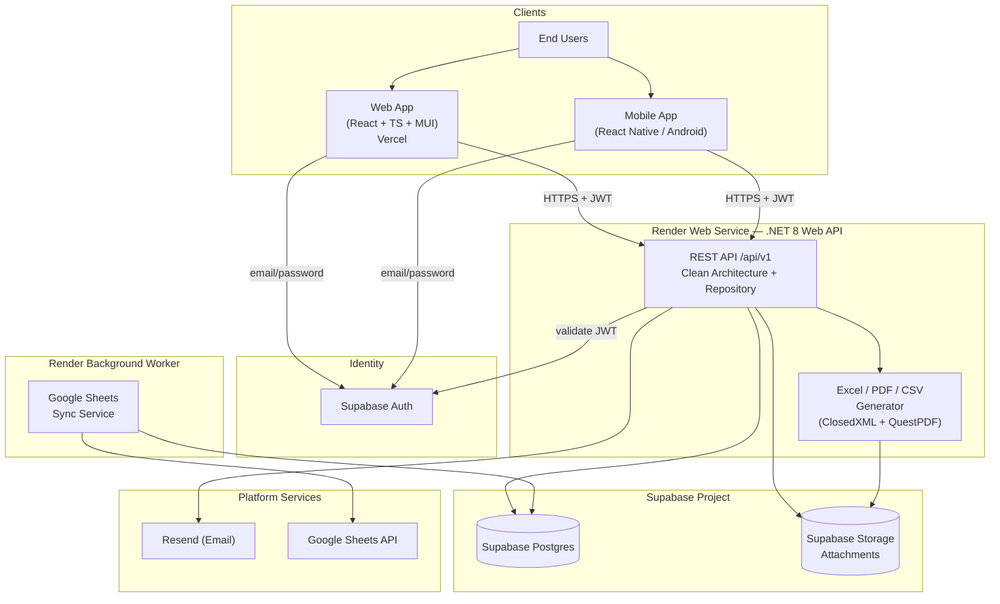
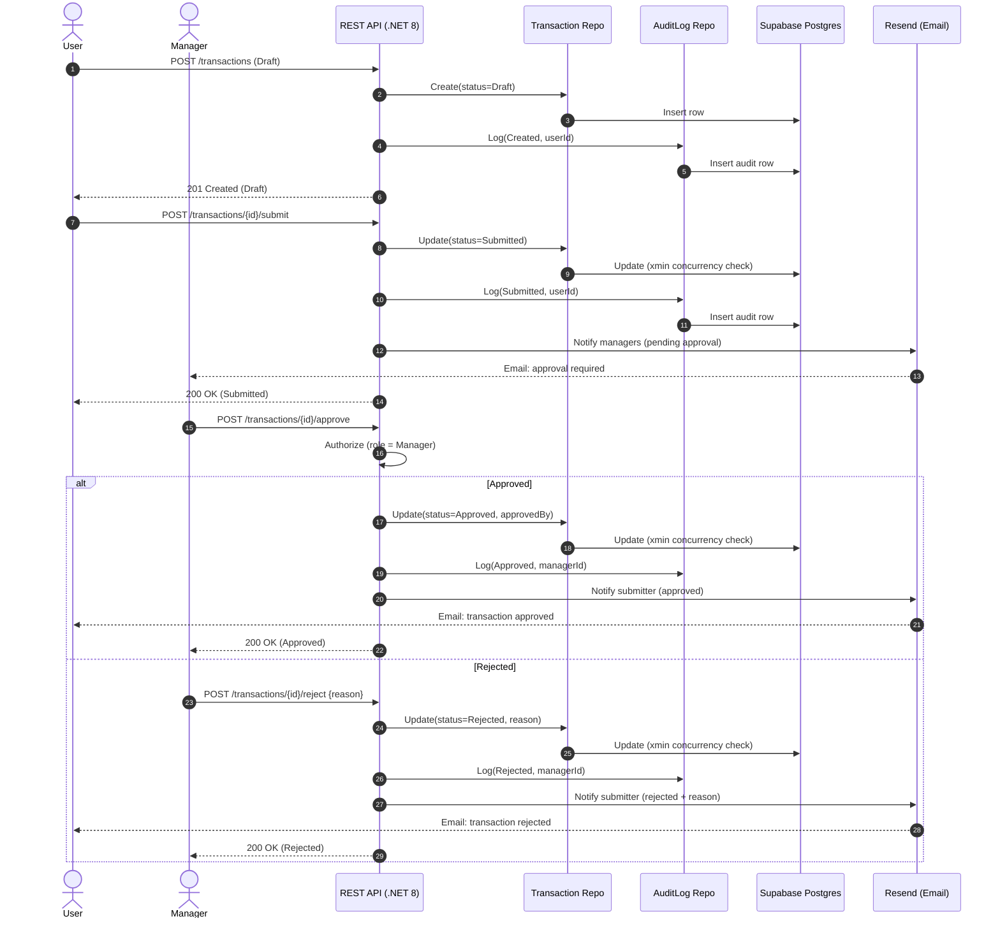
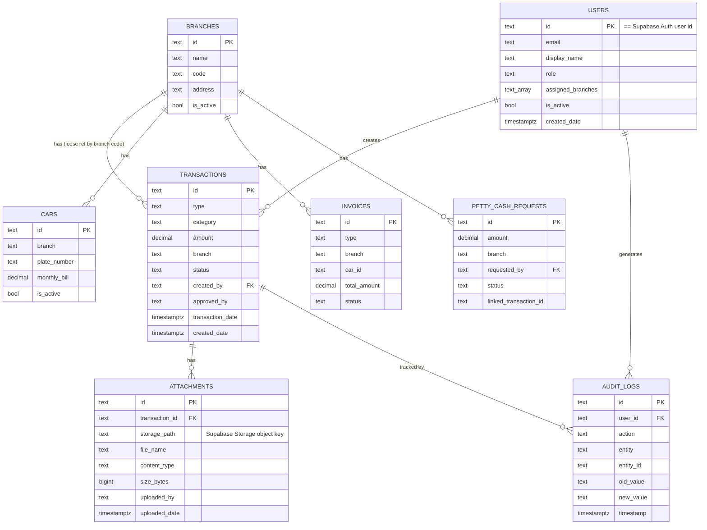
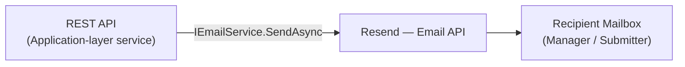

# Finance Ledger Pro — Solution Architecture

> **Version:** 2.0 — Render + Supabase + Vercel free-tier stack
> **Status:** Production baseline
> **Audience:** Engineering, DevOps, Security, and Solution Architects

---

## 1. System Overview

**Finance Ledger Pro** is a multi-tenant financial ledger platform used by branch-based
organizations to record, approve, and report on financial transactions. It is delivered
through three clients — a **React + TypeScript (MUI) web app**, a **React Native Android
app**, and a set of automated integrations — all backed by a single **ASP.NET Core 8 Web API**.

The platform is built on **free-tier PaaS** (Render + Supabase + Vercel) and follows
**Clean Architecture** with the **Repository pattern** for persistence abstraction.

### 1.1 Core Capabilities

| Capability | Description |
|------------|-------------|
| Transaction lifecycle | Draft → Submitted → Approved / Rejected with full audit trail |
| Role-based access | `Manager` (full access) and `User` (limited) |
| Reporting | Daily, monthly, yearly aggregations + dashboard KPIs |
| Exports | Excel (ClosedXML), PDF (QuestPDF), CSV |
| Attachments | Receipts/documents stored in Supabase Storage |
| Notifications | Approval emails via Resend |
| External sync | One-way sync to Google Sheets via a background Worker |
| Observability | `/health` + `/health/ready` endpoints |
| Secrets | Render/Vercel environment variables (no secrets in config or code) |

### 1.2 Technology Stack

| Layer | Technology |
|-------|-----------|
| Web client | React 18, TypeScript, Material UI (MUI) |
| Mobile client | React Native (Android) |
| API | ASP.NET Core 8 Web API |
| Datastore | Supabase Postgres |
| File storage | Supabase Storage |
| Compute | Render (API Web Service + Worker Background Worker), Vercel (web) |
| Identity | Supabase Auth + JWT + refresh tokens |
| Email | Resend |
| Secrets | Render/Vercel environment variables |
| Telemetry | `/health`, `/health/ready` (Sentry free tier optional, not wired up) |
| Schema | Supabase SQL migrations (`supabase/migrations`) |
| CI/CD | Render/Vercel git-native auto-deploy; GitHub Actions for CI checks |
| Reporting libs | ClosedXML (Excel), QuestPDF (PDF) |

---

## 2. Design Principles — Clean Architecture

The solution enforces the **Dependency Rule**: source-code dependencies point only
*inward*. Inner layers know nothing about outer layers.

```
┌───────────────────────────────────────────────────────────┐
│  Presentation  (API Controllers, Middleware, Filters)      │  ← depends on Application
│  ┌─────────────────────────────────────────────────────┐  │
│  │  Application  (Use-cases, DTOs, Interfaces, Services) │  │  ← depends on Domain
│  │  ┌───────────────────────────────────────────────┐  │  │
│  │  │  Domain  (Entities, Enums, Value Objects,       │  │  │  ← depends on nothing
│  │  │           Domain events, Business rules)        │  │  │
│  │  └───────────────────────────────────────────────┘  │  │
│  └─────────────────────────────────────────────────────┘  │
│  Infrastructure  (Postgres repos, Storage, Auth, Email)    │  ← implements Application interfaces
└───────────────────────────────────────────────────────────┘
```

### 2.1 Project Layout

| Project | Responsibility |
|---------|---------------|
| `FinanceLedgerPro.Domain` | Entities, enums, value objects, domain events, invariants. No external dependencies. |
| `FinanceLedgerPro.Application` | Use-cases (CQRS handlers), DTOs, validators (FluentValidation), repository/service **interfaces**. |
| `FinanceLedgerPro.Infrastructure` | Postgres (Npgsql/EF Core) repositories, Supabase Storage client, Supabase Auth client, Resend email service, Google Sheets client. Implements Application interfaces. |
| `FinanceLedgerPro.Api` | Controllers, middleware, DI wiring, auth, versioning, Swagger. |
| `FinanceLedgerPro.Worker` | Background service for Google Sheets sync. |
| `FinanceLedgerPro.Tests.*` | Unit / integration tests. |

### 2.2 Cross-Cutting Principles

- **SOLID** — small, single-purpose classes; dependency inversion via interfaces.
- **Command/query services** — Application-layer services expose the use-cases; controllers stay thin.
- **Repository + Unit-of-Work** — Postgres access hidden behind `IRepository<T>` interfaces.
- **DTO boundary** — domain entities never leave the Application layer; controllers speak DTOs.
- **Fail-fast validation** — FluentValidation at the edge; domain invariants inside entities.
- **Idempotency** — optimistic concurrency via Postgres's built-in `xmin` system column
  (EF Core `UseXminAsConcurrencyToken()`), no explicit version column needed.
- **Twelve-factor config** — all secrets from Render/Vercel environment variables; environment-driven config.

---

## 3. Architecture Diagram



---

## 4. Transaction Approval Flow (Sequence)

The core business workflow: a `User` drafts and submits a transaction; a `Manager`
approves or rejects it. Every state change writes an immutable **AuditLog** entry, and
approval/rejection triggers an email notification.



---

## 5. Data Model — Entity Relationships



There are no database-level foreign keys — the previous Cosmos design had none either
(each container was an independent document store), and the app enforces referential
integrity in the Application layer, not via SQL constraints.

---

## 6. Postgres Schema Design (Supabase)

Supabase Postgres replaces Cosmos DB with one **table per aggregate** — 8 tables in
total (the original 5-container design only covered `Transactions`/`Users`/`AuditLogs`/
`Branches`/`Attachments`; `Cars`, `Invoices`, and `PettyCashRequests` are additional
aggregates that exist in the real domain model and migrate the same way). Schema is
defined as plain SQL in `supabase/migrations/0001_init.sql`, applied via the Supabase
CLI (`supabase db push`) or the dashboard SQL editor — see
[free-tier-deployment.md](free-tier-deployment.md).

> **Global conventions:** `id` is a `text` GUID (unchanged from the Cosmos design, so
> no ID re-mapping was needed). There are no foreign keys — the previous Cosmos design
> had none either, since each container was an independent document store; the app
> enforces referential integrity in the Application layer. Optimistic concurrency uses
> Postgres's built-in `xmin` system column per row (via EF Core's
> `UseXminAsConcurrencyToken()`), replacing Cosmos's ETag check — no explicit version
> column exists in any table.

### 6.1 Table: `transactions`

**Indexes** (equivalent to the composite indexes the Cosmos design used to keep
per-branch reporting cheap):

```sql
create index ix_transactions_branch_date       on transactions (branch, transaction_date desc);
create index ix_transactions_branch_status_date on transactions (branch, status, transaction_date desc);
create index ix_transactions_branch_type_date   on transactions (branch, type, transaction_date desc);
create index ix_transactions_created_by         on transactions (created_by);
create index ix_transactions_approved_by        on transactions (approved_by);
```

Columns mirror `FinanceLedger.Domain.Entities.Transaction`: `id`, `type`
(`Income`/`Expense`), `category`, `description`, `amount`, `transaction_date`,
`branch`, `created_by`, `created_by_name`, `created_date`, `status`
(`Draft`/`Submitted`/`Approved`/`Rejected`), `approved_by`, `approved_date`,
`attachment_ids` (`text[]`), `related_user_id`, `car_id`.

### 6.2 Table: `users`

`id` is the **Supabase Auth user id** (`auth.users.id`) — the app provisions the Auth
identity first (via the Admin API), then inserts this row with the same id, so the two
stay joined without a mapping table. `role` and `assigned_branches` are also mirrored
into the Auth user's `app_metadata` (see §8.1) so RBAC claims are embedded directly in
every access token Supabase issues, avoiding a database round-trip per request.

```sql
create unique index ix_users_email on users (lower(email));
create index ix_users_role on users (role);
```

Columns: `id`, `email`, `display_name`, `role` (`Manager`/`User`), `assigned_branches`
(`text[]`), `is_active`, `created_date`, `password_hash` (unused since the move to
Supabase Auth — kept nullable because the Domain entity still has the property).

### 6.3 Table: `audit_logs`

Append-only — rows are never updated, only inserted, mirroring the Cosmos design's
immutability.

```sql
create index ix_audit_logs_user_timestamp   on audit_logs (user_id, timestamp desc);
create index ix_audit_logs_entity_timestamp on audit_logs (entity_id, timestamp desc);
```

Columns: `id`, `user_id`, `user_name`, `action`
(`Create`/`Update`/`Delete`/`Approve`/`Reject`/`Void`), `entity`, `entity_id`,
`old_value`, `new_value`, `timestamp`.

### 6.4 Table: `branches`

Small, slow-changing reference table.

```sql
create unique index ix_branches_code on branches (code);
```

Columns: `id`, `name`, `code`, `address`, `is_active`.

### 6.5 Table: `attachments`

`storage_path` holds a **Supabase Storage object key** scoped to the private
`attachments` bucket (e.g. `3fa8...pdf`), replacing the previous full Azure Blob URI —
the storage bytes live in Supabase Storage; this table holds only metadata + the
locator, same division of responsibility as before.

```sql
create index ix_attachments_transaction_id on attachments (transaction_id);
```

Columns: `id`, `transaction_id`, `file_name`, `content_type`, `size_bytes`,
`storage_path`, `uploaded_by`, `uploaded_date`.

### 6.6 Tables: `petty_cash_requests`, `cars`, `invoices`

Three additional aggregates present in the real domain model (petty cash approval
workflow, car rental fleet, and client invoicing) that the original 5-container
migration prompt didn't account for — they migrate with the same pattern as the tables
above. See `supabase/migrations/0001_init.sql` for exact columns and indexes
(`(branch, status)`/`(requested_by)` on `petty_cash_requests`, `(branch)` on `cars`,
`(branch, invoice_date desc)`/`(status)` on `invoices`).

### 6.7 Table Summary

| Table | Primary access pattern | Notes |
|-------|------------------------|-------|
| `transactions` | Per-branch reporting & aggregation | Composite indexes on (branch, status/type, date) |
| `users` | Point read by token subject (`id`) | `id` == Supabase Auth user id |
| `audit_logs` | Per-user / per-entity audit history (append-only) | No updates, ever |
| `branches` | Point read / small cached list | Unique index on `code` |
| `attachments` | List attachments for a transaction | `storage_path` → Supabase Storage object key |
| `petty_cash_requests` | Per-branch pending approvals | |
| `cars` | Per-branch fleet listing | |
| `invoices` | Per-branch invoice listing | |

---

## 7. RBAC Matrix

Two roles: **Manager** (full access) and **User** (limited). Users operate within their own
branch and on their own transactions; Managers operate across branches.

| Action | Manager | User |
|--------|:-------:|:----:|
| Log in / refresh / logout | ✅ | ✅ |
| Reset own password | ✅ | ✅ |
| View own transactions | ✅ | ✅ |
| View all/other users' transactions | ✅ | ❌ |
| Create transaction (Draft) | ✅ | ✅ |
| Update own Draft transaction | ✅ | ✅ |
| Update another user's transaction | ✅ | ❌ |
| Submit transaction | ✅ | ✅ |
| **Approve** transaction | ✅ | ❌ |
| **Reject** transaction | ✅ | ❌ |
| Delete Draft transaction | ✅ (any) | ✅ (own only) |
| View dashboard (own scope) | ✅ | ✅ |
| View dashboard (all branches) | ✅ | ❌ |
| Reports: daily / monthly / yearly (own branch) | ✅ | ✅ (own branch) |
| Reports across all branches | ✅ | ❌ |
| Export Excel / PDF / CSV (own scope) | ✅ | ✅ |
| Export across all branches | ✅ | ❌ |
| Upload attachment | ✅ | ✅ |
| Delete attachment | ✅ (any) | ✅ (own only) |
| List / view branches | ✅ | ✅ (read) |
| Create / update / deactivate branch | ✅ | ❌ |
| List users | ✅ | ❌ |
| Create / update / deactivate user | ✅ | ❌ |
| Change a user's role | ✅ | ❌ |
| View audit logs | ✅ | ❌ (own actions only) |

> Enforcement occurs at **two layers**: ASP.NET Core `[Authorize(Roles=...)]` +
> policy-based authorization handlers (for resource-ownership checks such as "own branch /
> own transaction"), and again inside Application-layer use-cases as a defense-in-depth check.

---

## 8. Security Architecture

### 8.1 Authentication & Tokens

- **Identity provider:** Supabase Auth. Clients authenticate with email/password
  against Supabase's GoTrue REST API (`POST /auth/v1/token?grant_type=password`); the
  API's `/auth/*` endpoints proxy this so the client-facing contract is unchanged from
  the Entra days.
- **Access tokens:** JWTs issued and signed by Supabase (HS256, legacy shared secret),
  validated by the API against `SUPABASE_JWT_SECRET` (issuer, audience, signature,
  expiry).
- **Refresh tokens:** Issued and rotated by Supabase Auth on each
  `grant_type=refresh_token` call — the API no longer maintains its own refresh-token
  store. Stored **httpOnly + Secure + SameSite** cookies for the web client; secure
  encrypted storage (Android Keystore) for mobile.
- **Claims:** `sub`, `email` come from Supabase directly. `role` (Manager/User) and
  `branches` are **not** Supabase's built-in fields — they're stored in the app's own
  `users` table (source of truth) and mirrored into the Supabase Auth user's
  `app_metadata` whenever a Manager creates/updates a user (via the Admin API).
  Supabase embeds `app_metadata` into every token it issues, and a
  `IClaimsTransformation` (`SupabaseClaimsTransformation`) maps it into
  `ClaimTypes.Role` / a `branches` claim on every request, so downstream authorization
  code is unchanged.
- **Logout:** The API relays the caller's current access token to Supabase's
  `POST /auth/v1/logout`, which revokes that session server-side.

### 8.2 Authorization (RBAC)

- Role claims drive `[Authorize(Roles="Manager")]` on privileged endpoints.
- **Policy-based** handlers enforce resource ownership (own branch, own transaction).
- Defense-in-depth: use-case handlers re-check permissions before mutating.

### 8.3 Data Validation

- **FluentValidation** on all inbound DTOs (required fields, ranges, currency codes,
  enum membership, string length).
- **Domain invariants** enforced inside entities (e.g., cannot approve a Draft; amount > 0).
- Model binding rejects unknown/oversized payloads (request-size limits).

### 8.4 Rate Limiting

- ASP.NET Core **built-in rate limiter** (`Microsoft.AspNetCore.RateLimiting`).
- **Fixed-window** per authenticated user (`sub`) and per IP for anonymous endpoints
  (login, reset-password): e.g., 100 req/min authenticated, 10 req/min for auth endpoints.
- Returns `429 Too Many Requests` with `Retry-After` and rate-limit headers (see API ref).

### 8.5 API Versioning

- URL-segment versioning: `/api/v1/...` via `Asp.Versioning.Http`.
- New breaking changes ship under `/api/v2`; old versions supported through a deprecation
  window and advertised via `api-supported-versions` / `api-deprecated-versions` headers.

### 8.6 Transport Security

- **HTTPS enforced** (`UseHttpsRedirection` + HSTS with `includeSubDomains; preload`).
- TLS 1.2+ only, terminated at Render/Vercel's edge.
- CORS locked to known web/mobile origins.

### 8.7 OWASP Top 10 (2021) Mapping

| OWASP Risk | Mitigation in Finance Ledger Pro |
|------------|----------------------------------|
| A01 Broken Access Control | RBAC + policy-based ownership checks; deny-by-default; re-checked in use-cases |
| A02 Cryptographic Failures | TLS 1.2+, HSTS; secrets in Render/Vercel env vars; tokens signed (HS256); Storage bucket private, server-only access |
| A03 Injection | Parameterized EF Core/Npgsql queries; no string-concatenated SQL; input validation |
| A04 Insecure Design | Clean Architecture, threat-modeled approval flow, least-privilege service_role key usage |
| A05 Security Misconfiguration | SQL migrations checked into source, no debug in prod, minimal error detail, security headers middleware |
| A06 Vulnerable Components | Dependabot/`dotnet list package --vulnerable`, pinned versions, CI SCA scan |
| A07 Identification & Auth Failures | Supabase Auth, rotating refresh tokens, provider-managed credential storage |
| A08 Software & Data Integrity | CI-built artifacts, git-native deploy (no long-lived cloud creds embedded in CI) |
| A09 Logging & Monitoring Failures | Structured logging (Serilog) + immutable `audit_logs`; `/health/ready` for external monitoring |
| A10 Server-Side Request Forgery | No user-supplied URLs fetched server-side; outbound calls allow-listed (Supabase, Resend, Google Sheets only) |

### 8.8 Secret Management

- **No secrets in source or committed config.** Local dev reads from
  `appsettings.Development.json` (non-production values only) or a local `.env`;
  production reads from Render's and Vercel's built-in environment variable storage.
- `appsettings.Production.json` keeps the same `#{PLACEHOLDER}#` token convention as
  before — real values are injected as environment variables at deploy time, never
  committed.
- Secrets: `POSTGRES_CONNECTION_STRING`, `SUPABASE_URL`, `SUPABASE_ANON_KEY`,
  `SUPABASE_SERVICE_ROLE_KEY`, `SUPABASE_JWT_SECRET`, `RESEND_API_KEY`,
  `GOOGLE_SHEET_ID`, `GOOGLE_SHEETS_CREDENTIALS_JSON`. See
  [.env.example](../.env.example) for the full list.
- Rotation: update the value in the Render/Vercel dashboard and redeploy (or trigger a
  restart) — no external secrets manager or reference-resolution step involved.

### 8.9 Middleware Pipeline (order matters)

```
1.  Exception-handling middleware  → RFC7807 ProblemDetails
2.  HSTS
3.  HTTPS redirection
4.  Security headers (CSP, X-Content-Type-Options, X-Frame-Options, Referrer-Policy)
5.  Correlation-ID / request logging (Serilog)
6.  Routing
7.  CORS
8.  Rate limiter
9.  Authentication (JWT bearer)
10. Authorization (roles + policies)
11. API versioning
12. Response caching (safe GETs)
13. Endpoints (controllers)
```

---

## 9. Notification Architecture

`IEmailService` (`Application/Interfaces/IEmailService.cs`) is implemented by
`ResendEmailService`, a thin HTTP client over Resend's transactional email API,
registered in DI and ready to use.

> **Current state:** no Application-layer code calls `IEmailService` yet — this was
> true before the migration too (the previous `EmailService`/Azure Communication
> Services implementation was equally unused). The interface, DI wiring, and free-tier
> provider are in place so that wiring up approval-notification emails (Submitted →
> notify managers, Approved/Rejected → notify the submitter, password reset) is a
> matter of calling `IEmailService.SendAsync(...)` from the relevant Application
> service — not a new architectural decision.



---

## 10. Observability & Operations

- **Health checks**: `GET /health` is a liveness probe (always 200 once the process is
  up, no dependency checks — used as Render's own health check path). `GET
  /health/ready` additionally checks Postgres (`AspNetCore.HealthChecks.NpgSql`) and
  Supabase Storage reachability — intended for external/manual monitoring, not as the
  platform's health check path (a transient Postgres blip shouldn't make Render kill a
  healthy process).
- **Structured logging** via Serilog, writing to console (captured by Render's log
  stream).
- **Application Insights was not replaced with an equivalent** — optional at this
  scale; wire up Sentry's free tier separately if error tracking is wanted.

---

## 11. Google Sheets Sync Worker

A Render **Background Worker** (`FinanceLedger.Worker`) polls Postgres on a timer
(`Sync:IntervalMinutes`, default 15) for transactions with `status = Approved`, and
pushes them to a configured Google Sheet (`GOOGLE_SHEET_ID`) for finance teams that
work in Sheets. A manual-trigger channel (`ManualSyncTrigger`) also exists for
on-demand runs, e.g. from an admin endpoint.

- Uses a Google **service account** (JSON credential passed via
  `GOOGLE_SHEETS_CREDENTIALS_JSON`).
- **Polling, not a change feed** — Cosmos's change feed has no Postgres equivalent in
  this design; querying `status = Approved` on the indexed `transactions` table is
  cheap enough at this scale. There is currently no "already synced" flag, and
  `GoogleSheetsService` appends rows (`Values.Append`) rather than upserting — so every
  sync cycle re-appends every approved transaction to the sheet. This is pre-existing
  behavior (unchanged by this migration, not something the Cosmos design solved
  either) worth fixing separately if the Sheet needs to stay duplicate-free.
- One-way sync (Postgres → Sheets); Sheets is read-only downstream.
- Failures are logged and the worker continues on the next tick (or the next manual
  trigger) rather than crashing the process.
